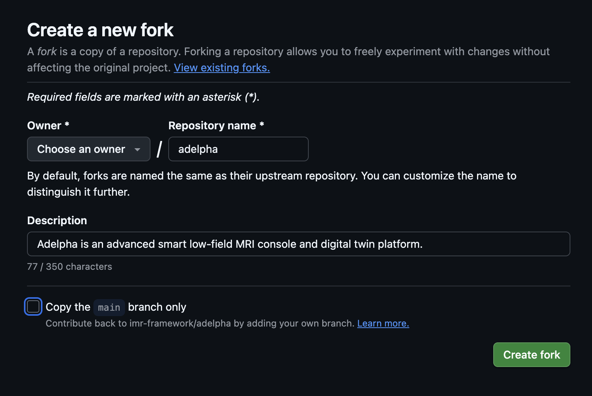

<div align="center">

<!--  -->

# Adelpha MRI

</div>

**Adelpha** is an open-source, intelligent digital-twin platform for developing, monitoring, and operating low-field MRI systems. It integrates scanner visualization, real-time system data, imaging workflows, engineering tools, and AI-assisted capabilities within a unified environment. Its modular architecture can also be adapted to other MRI systems and research applications.

<div align="center">


</div>

> [!NOTE]
> Packaging and signing: [`docs/packaging/index.md`](docs/packaging/index.md). DTAM is MIT; the imaging console in the sidecar is GPL-3.

## Clone

```bash
git clone https://github.com/imr-framework/adelpha.git
```

Clone a specific branch with `-b`.

```bash
git clone -b [branch_name] https://github.com/imr-framework/adelpha.git
```
Example:

```bash
git clone -b workshop/delta-2026 https://github.com/imr-framework/adelpha.git
```

To fetch only that branch:

```bash
git clone -b [branch_name] --single-branch https://github.com/imr-framework/adelpha.git
```

If you already have a clone, switch with `git checkout [branch_name]`.

## Contribute workshop notebooks

DELTA DIY MRI workshop notebooks live in [`console/notebooks/`](console/notebooks/) on the **`workshop/delta-2026`** branch. Open pull requests **into that branch**, not `main`.

1. Fork the repo with all its branches
Fork the adelpha repo. While forking, be sure to uncheck `copy the main branch only` so that you get all the branches on your fork.


2. Clone the workshop branch from your fork.

   ```bash
   git clone -b workshop/delta-2026 [your repo url]
   cd adelpha
   ```

   Or, in an existing clone:

   ```bash
   git fetch origin
   git checkout workshop/delta-2026
   git pull --rebase origin workshop/delta-2026
   ```

3. Start a short-lived branch from `workshop/delta-2026` (do not commit on the shared workshop branch).

   ```bash
   git checkout -b workshop/notebooks-your-topic
   ```

4. Add or edit notebooks only under `console/notebooks/`. Name files `NN_short_name.ipynb` so they sort in teaching order (`01_setup_environment.ipynb` is the setup notebook). Use a title cell that states the session goal. Also you can group them in subfolders such as console/notebooks/acq for acquisition notebooks.

5. Do not commit the workshop virtualenv, checkpoints, or bulky execution output. `console/notebooks/.diy-mri-workshop/` and `.ipynb_checkpoints/` stay local. Clear cell outputs before you commit if a notebook grew large.

6. Commit, push, and open a PR **against `workshop/delta-2026`**.

   ```bash
   git add console/notebooks/
   git commit -m "Add workshop notebook: short description"
   git push -u origin HEAD
   ```

   On GitHub, set the PR base to `workshop/delta-2026`. With `gh`:

   ```bash
   gh pr create --base workshop/delta-2026 --title "Add workshop notebook: short description" --body "Mentor notebook for the DELTA DIY MRI workshop."
   ```

## Install (developers)

**Requirements:** Node.js 18+, [Rust](https://rustup.rs/) (stable), Python 3.10–3.12, optional [uv](https://docs.astral.sh/uv/) for docs.

```bash
make install
make tauri-dev
```

The terminal and native file dialogs need Tauri. `npm run dev` is browser-only; start Twin / Agents / MRI APIs yourself (see [Getting started](docs/start/index.md)).

### Packaged installer (this OS)

```bash
make sidecar
make dist-current
make test-runtime
```

## User data

Written next to other apps, never into the `.app`: MRI data under `<app-data>/mri4all`, logs in `<app-log>/supervisor.log`, optional Agents key in `<app-config>/google_api_key`. Imported CAD stays in this machine’s IndexedDB.

## Documentation

Published site: [imr-framework.github.io/adelpha](https://imr-framework.github.io/adelpha/)

| Topic | Link |
| --- | --- |
| Getting started | [`docs/start/index.md`](docs/start/index.md) |
| About and maintainers | [`docs/about/index.md`](docs/about/index.md) |
| Architecture | [`docs/guide/architecture.md`](docs/guide/architecture.md) |
| Settings, CAD, camera, updates | [`docs/guide/settings.md`](docs/guide/settings.md) |
| Imaging Console / Red Pitaya | [`docs/guide/imaging-console.md`](docs/guide/imaging-console.md) |
| MaRCoS integration | [`docs/about/marcos.md`](docs/about/marcos.md) |
| MRI4ALL attribution | [`docs/about/mri4all.md`](docs/about/mri4all.md) |
| Citation and licensing | [`docs/about/citation.md`](docs/about/citation.md) |
| Intended use | [`docs/about/intended-use.md`](docs/about/intended-use.md) |
| Desktop packaging | [`docs/packaging/index.md`](docs/packaging/index.md) |

Maintainers: Adelpha contributors and the Accessible Magnetic Resonance Laboratory (AMRL). Cite via [`CITATION.cff`](CITATION.cff).

```bash
uv sync --group docs && make docs-serve
```

## Troubleshooting

| Symptom | Fix |
| --- | --- |
| Recovery screen | `<app-log>/supervisor.log`; export diagnostics |
| Agents offline | Settings → AI & Agents (or `GOOGLE_API_KEY` in `dtam/.env` for browser mode) |
| Imaging Console empty | Console service must be up |
| Exam vanished after restart | Expected. Register again. |
| Camera denied (Mac) | System Settings → Camera, or `tccutil reset Camera org.adelpha.digital-twin-ui` |
| Black window after CAD import | Settings → Files → Clear all imports, or remove `~/Library/WebKit/org.adelpha.digital-twin-ui` |
| Terminal has no shell | Desktop app only. Not `npm run dev`. |
