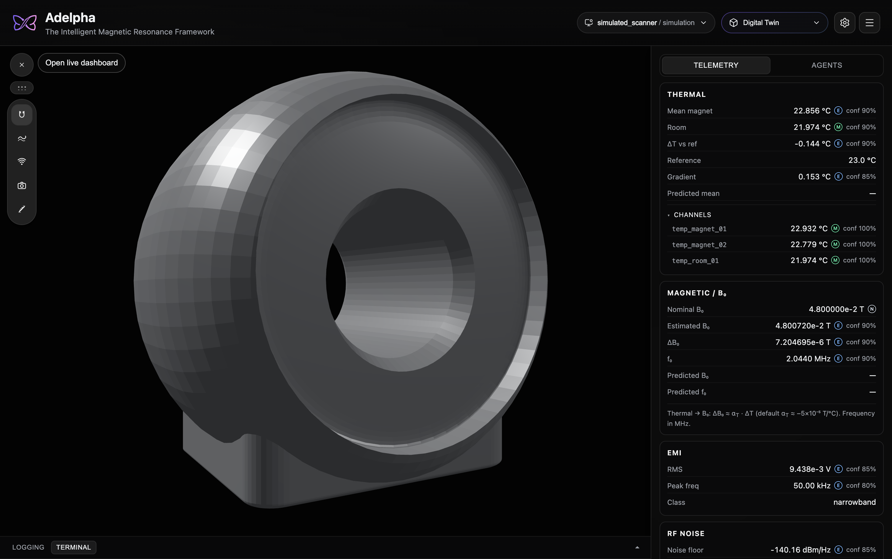

<div align="center">

# Adelpha




</div>

> [!NOTE]
> Adelpha requires DTAM. Live data comes from **[DTAM](https://github.com/imr-framework/dtam)** on your machine (`make twin-api` on port **8080**). Without that backend the app opens but stays disconnected.

## Install

**Requirements:** 
- [Node.js 18+](https://nodejs.org/)
- **DTAM** clone next to this repo
- [uv](https://docs.astral.sh/uv/) (for DTAM Python deps) 

```text
~/dtam              ← backend
~/adelpha           ← this repo
```

### 1. Start the twin backend

In a terminal, from your **DTAM** clone (keep it running):

#### Install

```bash
cd dtam
uv sync --all-groups
```

#### Servers
Run the following servers (use different terminals for each).
These servers also directly serve `Adelpha` if you are using it for you digital twin GUI.

```bash
make twin-api
make agents-api
```

### 2. Start the GUI

In a **third** terminal:

```bash
cd ..
cd adelpha
npm install
```
You can now build from source. Run any of the following commands based on what operating system (OS) your machine is running.

Once the executable files are ready, you will find the required setup in the `release` directory.

```bash
# Mac OS
npm run dist:mac

# Windows
npm run dist:win

# Debian
npm run dist:linux
```
If you want to run in development mode, do
```bash
npm run electron:dev
```

Open **http://localhost:5173/** (or the URL Vite prints). Within a few seconds you should see live **Thermal**, **B₀**, **EMI**, and **RF** values updating.

### Optional: Agents chat

For the **Agents** side-panel tab, start a third process in DTAM (requires `GOOGLE_API_KEY` in the DTAM repo `.env`):

```bash
cd ../dtam && make agents-api
```

Telemetry works without this; only chat stays offline.

## Verify

```bash
curl -s http://127.0.0.1:8080/health
```

Expect `"status":"ok"` and `"connected":true`. In the GUI, the console **Logging** tab should show a green live indicator.

## Documentation

Detailed setup, workspaces, desktop app, env vars, and troubleshooting:

| Topic | Link |
| --- | --- |
| Full getting started | [`docs/start/index.md`](docs/start/index.md) |
| Workspaces (Digital Twin · Imaging Console) | [`docs/guide/workspaces.md`](docs/guide/workspaces.md) |
| Configuration & proxies | [`docs/guide/configuration.md`](docs/guide/configuration.md) |
| macOS desktop package | [`docs/start/index.md#macos-desktop-package`](docs/start/index.md) |

Preview the docs site locally:

```bash
uv sync --group docs && make docs-serve
```

Published docs (GitHub Pages): [imr-framework.github.io/adelpha](https://imr-framework.github.io/adelpha/)

## Troubleshooting

| Symptom | Fix |
| --- | --- |
| Disconnected / no live data | Start `make twin-api` in DTAM and leave that terminal open |
| Agents tab offline | Run `make agents-api` in DTAM; set `GOOGLE_API_KEY` in DTAM `.env` |
| Port already in use | Use the alternate URL Vite prints in the terminal |

More help → [`docs/start/index.md`](docs/start/index.md#troubleshooting)

## Some fixes
Incase your teminal does not load a shell in the dev mode, run the following command:
```bash
npx electron-rebuild -f -w node-pty
```
