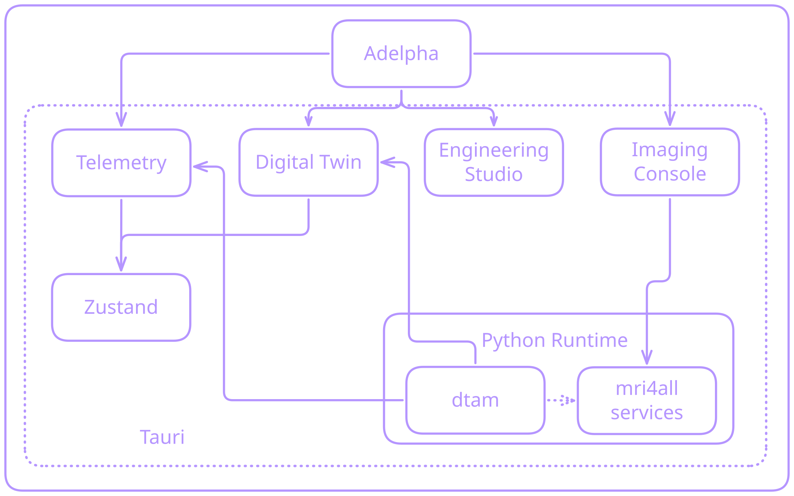

# Low-field MRI digital twins

Adelpha MRI’s twin is **DTAM**, vendored at `dtam/`. The GUI is a read-only observer of Twin HTTP state plus explicit forecast actions. It is built for **low-field** magnets (bundled 48 / 47 / 64 mT Halbach, Delta v2, simulated scanner) rather than clinical 1.5 T / 3 T systems.

<figure class="adelpha-preview">
  
  <figcaption>Desktop supervisor mounts DTAM next to the MRI façade. Twin telemetry never crosses into TypeScript hardware I/O.</figcaption>
</figure>

## Provenance is the product

Every live number in the Digital Twin workspace is labeled **measured**, **estimated**, **predicted**, or **nominal**. A PINN forecast must not look like a thermocouple.

| Source | Meaning in the UI |
| --- | --- |
| `measured` | Sensor or adapter reading |
| `estimated` | Twin estimate from the current window |
| `predicted` | Horizon forecast only (`POST /twin/forecast`) |
| `nominal` | Design value (for example packed \(B_0\)) |

The client polls `GET /twin/state` **without** a horizon so live channels stay cheap. Predicted scalars stay `null` until the operator requests a horizon. Mapping: `systemStateToTelemetry()` in the GUI; nested `SystemState` in the side panel (`state.thermal?.mean_magnet_temperature_c?.value`, …).

## Physics slice that actually runs

DTAM Phase 2 is a working thermal → \(B_0\) vertical slice, not a full Maxwell solver:

```text
Simulated (or measured) temperatures
  → synchronization window
  → thermal state estimate
  → thermal→B0 model
  → B0 / f0 estimate (+ optional prediction)
```

Coupling used in the twin:

\[
\Delta B_0(t) = \alpha_T \, \Delta T(t)
\]

\[
f_0(t) = \frac{\gamma}{2\pi}\, B_0(t)
\]

Default \(\alpha_T\) is \(-5\times10^{-5}\) T/°C in `configs/models.yaml`. Resonant frequency is reported in **MHz**; temperature in **°C**.

Optional **thermal PINN**: if `model.pt` / `model.onnx` exists, `ThermalMagneticTwin.update(..., predict_horizon_s=...)` uses it; otherwise prediction falls back to a constant heating rate. Train with `uv sync --extra pinn` inside `dtam/` — that is a developer path, not bundled in the installer.

EMI and RF channels are **heuristic estimators**, not a certified EMC report. Treat them as twin state, not lab accreditation.

## Scanner adapters

**Settings → Digital Twin** chooses the Python adapter the supervisor starts:

| Profile | Role |
| --- | --- |
| Simulated scanner | Plant + drift scenarios without hardware |
| 48 mT Halbach | Bundled low-field identity for the twin |

The **3D Model** page is a separate concern: which GLB you see. You can view Delta v2 CAD while the twin still runs the simulated adapter. Restart the Python runtime after a twin profile change.

Authoritative twin math and package map: `dtam/docs/digital_twin/` in this repository (not published on the Adelpha site). Operator surface: [Dashboard](../guide/dashboard.md) and [Twin API](../guide/twin-api.md).
