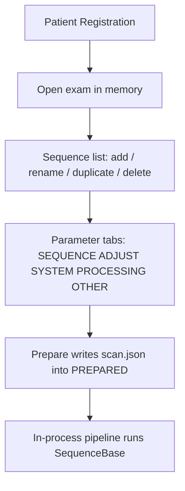

# Pulse-sequence and protocol management

Sequences in Adelpha MRI are MRI4ALL **plugins**, not a new pulse-sequence language. The Imaging Console lists them, edits parameters, and writes the exam queue. Python `SequenceBase` still builds the waveform.

## Catalog the GUI sees

`console/services/api/sequences_api.py` loads `SequenceBase` when the MRI4ALL environment is complete. If numba / numpy pins block that import (the desktop sidecar uses **numpy 2**), the façade serves a **FALLBACK** catalog so the UI still lists sequences:

| id | Name |
| --- | --- |
| `rf_se` | RF Spin-Echo |
| `tse_3D` | 3D Turbo Spin-Echo |
| `tse_2D` | 2D Turbo Spin-Echo |
| `gre_3D` | 3D Gradient Echo |
| `se_2D` | 2D Spin-Echo |

Plugin sources live in `console/sequences/` (for example `se_2D.py`). Parameter schema comes from `common.parameter_schema.schema_for_defaults`. Validate with the façade’s validate route before Prepare.

!!! warning "Fallback vs hardware"
    A sequence that appears in FALLBACK is a **catalog stub** with defaults. Running it on a board still requires the real `SequenceBase` module and a MaRCoS path. See [Packaging limitations](../packaging/limitations.md).

## Exam queue

Restarting the MRI API **clears the in-memory exam**. Protocols in the hamburger menu (**Exam → protocols**) are MRI4ALL protocol browser flows, rehosted in the React shell. Right-click on the sequence list to rename, duplicate, or delete entries for the open exam.

## What stays on disk

| Path class | Role |
| --- | --- |
| App data `mri4all/` | Packaged exam / raw / DICOM tree |
| `scan.json` + `PREPARED` | Same contract as MRI4ALL |
| Sequence Python files | Not edited by the GUI |

The TypeScript client talks only to `/api/mri` (desktop: supervisor gateway + session token). It never opens the Red Pitaya socket. Operator steps: [Imaging Console](../guide/imaging-console.md). Hardware: [MaRCoS](marcos.md).
